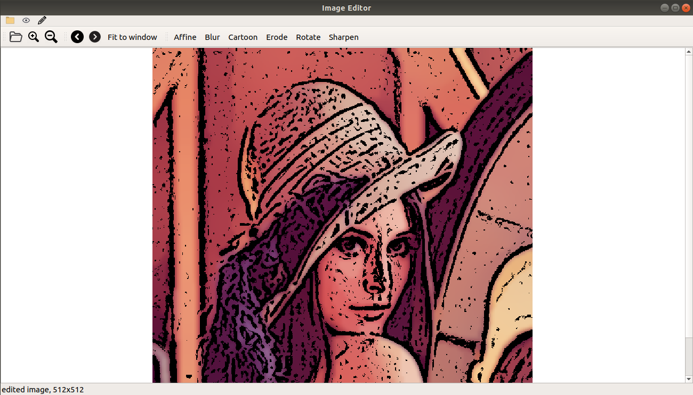

# Image Editor - Udacity C++ Nanodegree capstone project

This is my submission for capstone assignment in the [Udacity C++ Nanodegree Program](https://www.udacity.com/course/c-plus-plus-nanodegree--nd213): Capstone. 
The Image Editor App can be used to edit ones images. It can read images from our directory, perform various actios like rotate, affine, zoom in/out, etc.
The image can be saved after the editing. 

## Dependencies for Running Locally
1. QT == 5.5.1 (tested on this version only)
    Install QT: [click here for installation instructions](https://www.qt.io/download)
2. QMake == 3.0 (tested on this version only)
    Install QMake: [click here for installation instructions](https://doc.qt.io/archives/3.3/qmake-manual-2.html)
3. OpenCV
    Install OpenCV: [click here for installation instructions](https://docs.opencv.org/4.x/d7/d9f/tutorial_linux_install.html)
4. C++11

## Basic Build Instructions
1. cd workspace/ImageEditor/ImageEditorApp
2. rm -rf build
3. mkdir build && cd build
4. qmake .. && make
5. mv ImageEditor ../
6. cd ..
7. chmod a+x ImageEditor

## Running the software
1. cd workspace/ImageEditor/ImageEditorApp/
2. ./ImageEditor

## Output of the program.
mainwindow.cpp - handling gui
main.cpp - encapsultes object and starting point of project

Expected output-
    GUI in which image can be uploaded and can be interacted with using toolbar options
    statusbar shows information about file
    main toolbar- all plugins inside edit
    second toolbar- plugins on display
    keyboard shortcuts mentioned edit option in toolbar	 

## Some concepts used in the project

The project demonstrates an understanding of C++ functions and control structures. The project code is clearly organized into functions.
Examples- maiwindow.cpp, mainwindow.h, main.cpp

The project uses Object Oriented Programming techniques.
Examples- maiwindow.cpp, mainwindow.h, main.cpp

Classes use appropriate access specifiers for class members.
Examples- mainwindow.h, main.cpp

Class constructors utilize member initialization lists.
Examples- mainwindow.cpp, line 24, 30

Classes follow an appropriate inheritance hierarchy.
Example- mainwindow.h, line 16

The project uses scope / Resource Acquisition Is Initialization (RAII) where appropriate.

The project makes use of references in function declarations.
Example- mainwindow.cpp, line 146

Classes encapsulate behavior
Examples- maiwindow.cpp

Overloaded functions allow the same function to operate on different parameters.
Example- mainwindow.h, line 26, 27